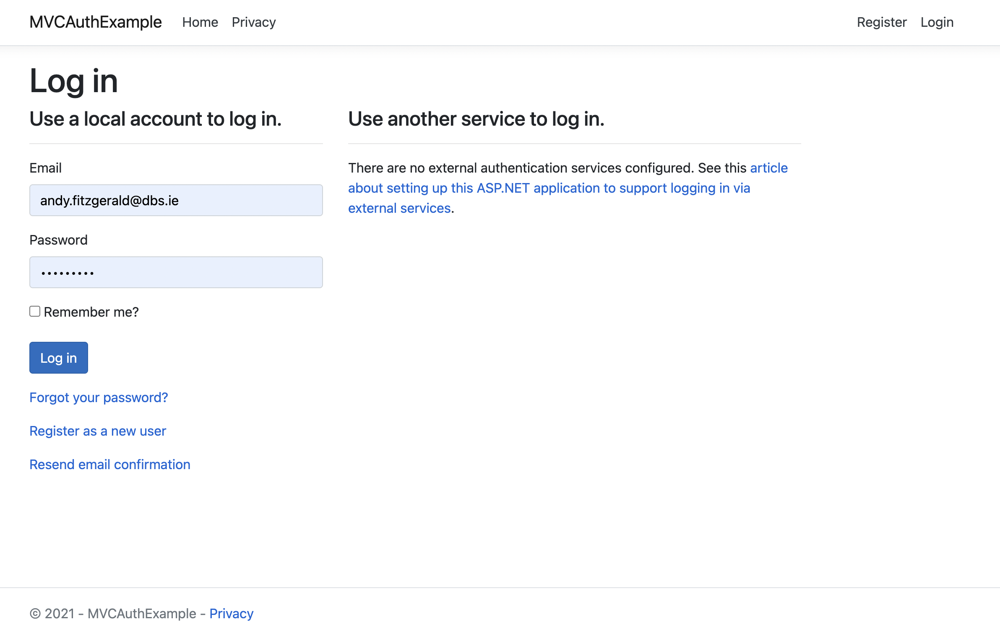
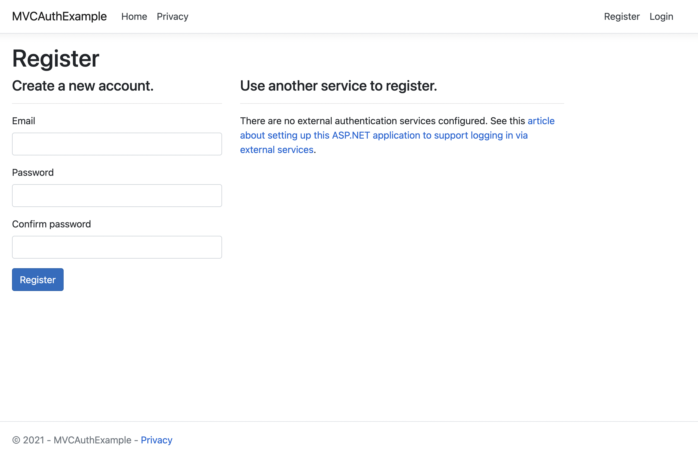
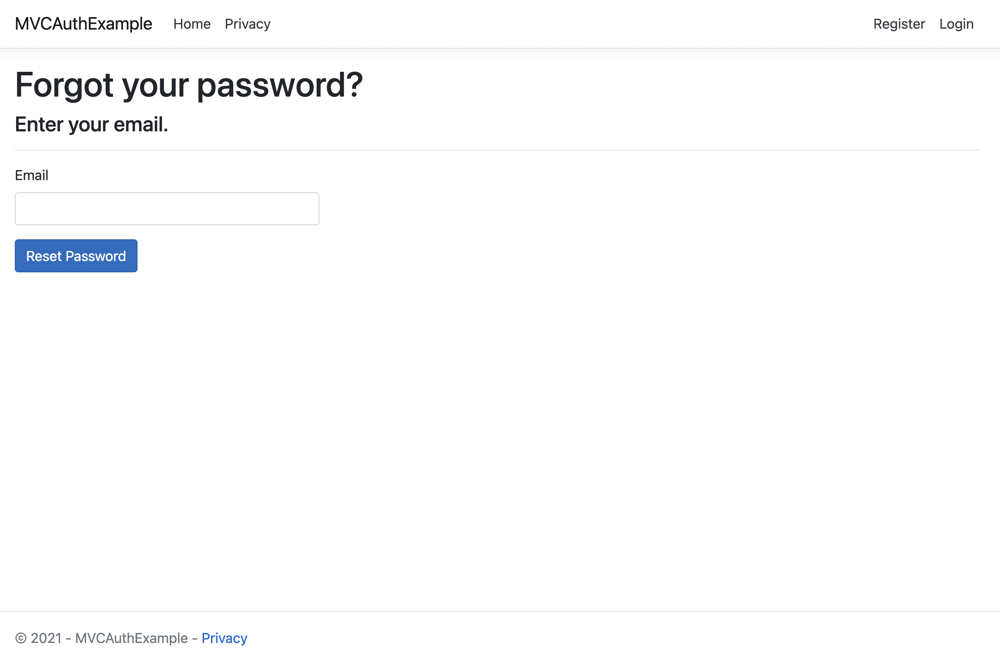
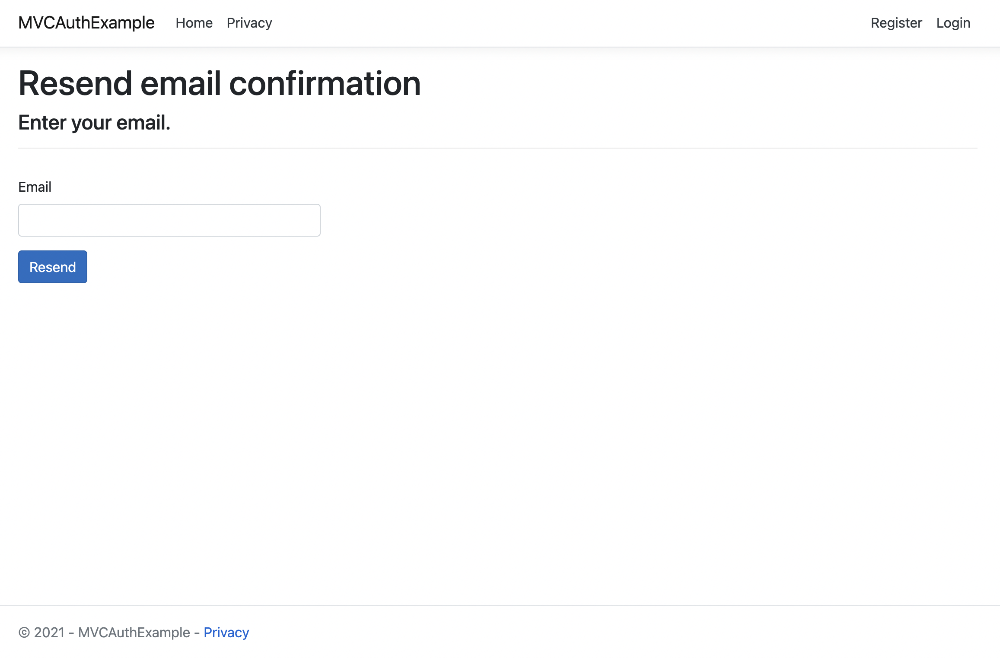

# Create New MVC App with Auth

### Requirments
* .Net Framework V5
* dotnet cli
* IDE of your choice - Visual Studio or Visual Studio Code


### Create 
Once you have the above installed, run the following command to setp the project
```
dotnet new mvc --auth Individual -uld -o MVCAuthExample    
```

### Verify
Run the application and verify that you can see the auto generated pages for the authentication flow.

```
dotnet run
```
Go to where the app has been started, by default its usually https://localhost:5001

#### Login Page


### Register Page


### Forgot Password Page


### Resend Email



