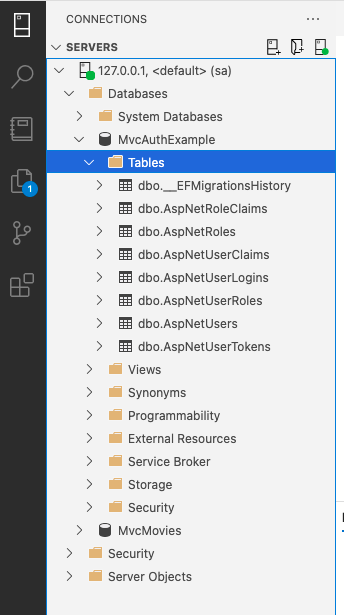
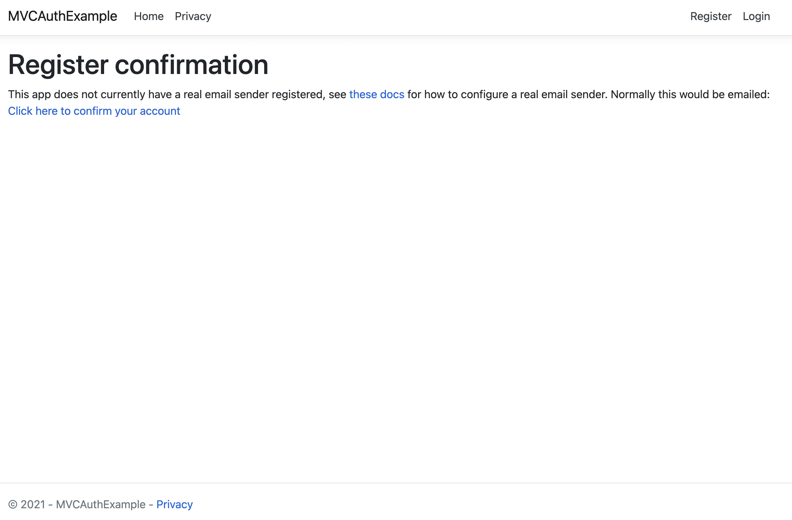
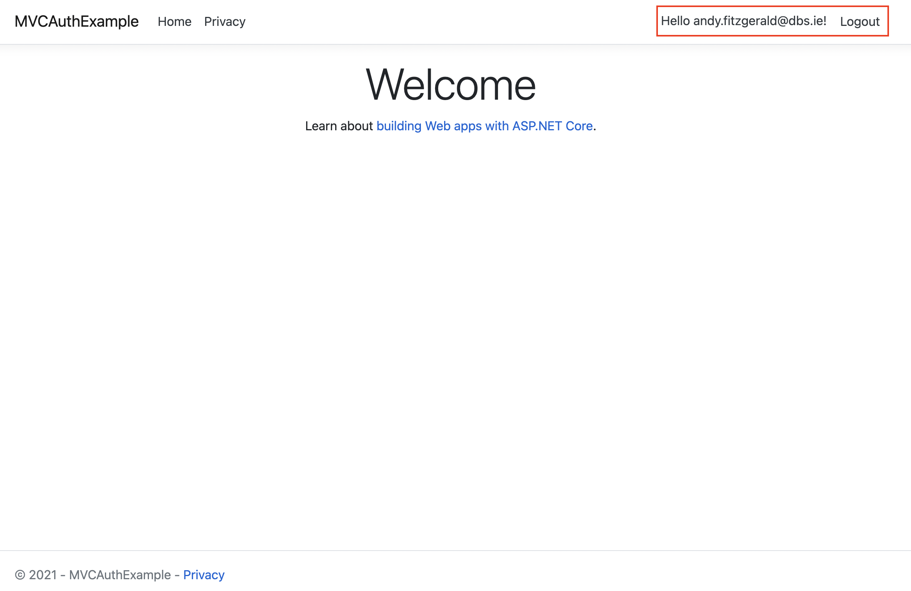
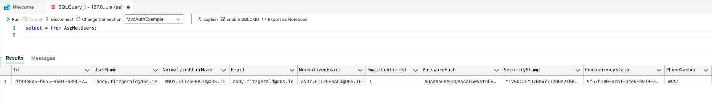

# Scaffold Identity

Before you can scaffold the identity tables, you need to make sure that your database connection is setup correctly. Lets check the Startup.cs file and see whats been set. 

```csharp
public void ConfigureServices(IServiceCollection services)
{
    services.AddDbContext<ApplicationDbContext>(options =>
        options.UseSqlServer(Configuration.GetConnectionString("DefaultConnection")));
    services.AddDatabaseDeveloperPageExceptionFilter();

    services.AddDefaultIdentity<IdentityUser>(options => options.SignIn.RequireConfirmedAccount = true)
                .AddEntityFrameworkStores<ApplicationDbContext>();
    services.AddControllersWithViews();
}
```

You can see above that the UseSqlServer configuration is set to use the <strong>DefaultConnection</strong>. The value for this is located in the <strong>appsettings.json</strong> file. Open it up and and you should see something similar:

```json
{
  "ConnectionStrings": {
    "DefaultConnection": "Server=(localdb)\\mssqllocaldb;Database=aspnet-MVCAuthExample-C8303DD1-4295-49C2-8F96-93B10D88543F;Trusted_Connection=True;MultipleActiveResultSets=true"
  },
  "Logging": {
    "LogLevel": {
      "Default": "Information",
      "Microsoft": "Warning",
      "Microsoft.Hosting.Lifetime": "Information"
    }
  },
  "AllowedHosts": "*"
}
```

Change the DefaultConnection string to your running MSSQL Database. 

```json
{
  "ConnectionStrings": {
    "DefaultConnection": "Server=localhost,1433;Database=MvcAuthExample;User ID=sa;Password=MyPass@word;Trusted_Connection=False;MultipleActiveResultSets=true"
    }
}

```

Make sure that the <strong>Trusted_Connection</strong> is set to false and the port number maps correctly to your running DB instance.

### Scaffold User Identity
When the project was created it auto populated the required migrations scripts for setting up the Identity Schemas. We just need to run the migrations in order to create them in our database. 

```shell
dotnet ef database update
```

### Verify
Open up your database - in my case I am using Azure Studio and check that the database contains tables for Identity.



You should see seven (eight including the EFMigrationsHistory table) new tables all starting with AspNet*. 

We can now test and see if the Identity is setup and working from our MVC UI. Start the app by running the following:

```shell
dotnet run
```

Go to the https://localhost:5001/Identity/Account/Register and fill in the form to register as a new user. If successful you should see a Register confirmation screen with a link asking you to confirm your account. See below:



Click the "Click here to confirm your account" and you then should get a "Confirm email" screen. Next, we will check to see if our login works. Go to the https://localhost:5001/Identity/Account/Login and enter the credentials you just created. 

If your login is successful, you should see a view similar to below. Note: your email address should now be on the top header along with a logout link.



### Database
So what happened and how did we manage to login? Lets first check our database. Open your DB IDE and run the following query:

```sql
select * from AspNetUsers;
```



You can now see that a user has been created along with your email you entered upon registering. You password is also encryped and not stored as plain text. 


