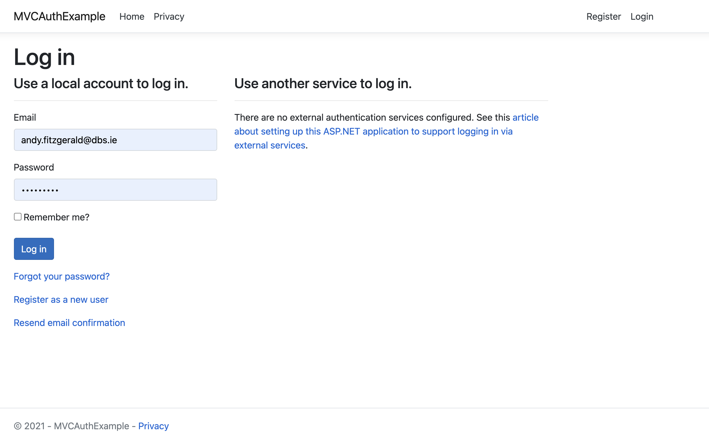
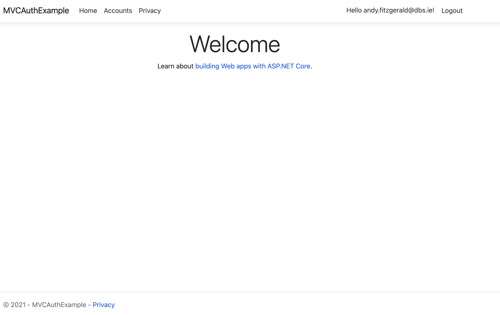

# Securing Views with Authorize
To test our authentication, we need to make sure that only logged in users can see the Accounts Page. To start, lets create a model called Account.

```csharp
using System;
using System.ComponentModel.DataAnnotations;
using System.ComponentModel.DataAnnotations.Schema;

namespace MVCAuthExample.Models
{
    public class Account
    {
        public int Id {get; set;}
        public string Name {get; set;}
        public string Type {get; set;}
        [Column(TypeName = "decimal(18,4)")]
        public decimal Total {get; set;}
    }
}
```

Lets scaffold the controller & views for Account. Make sure your project has the following dependencies installed:

```shell
dotnet tool install --global dotnet-ef
dotnet tool install --global dotnet-aspnet-codegenerator
dotnet add package Microsoft.EntityFrameworkCore.Design
dotnet add package Microsoft.VisualStudio.Web.CodeGeneration.Design
dotnet add package Microsoft.EntityFrameworkCore.SqlServer
```

Before running the code generator make sure that the path is available: (Linux/Mac only)

```shell
export PATH=$HOME/.dotnet/tools:$PATH
```

```shell
dotnet-aspnet-codegenerator controller -name AccountsController -m Account -dc ApplicationDbContext --relativeFolderPath Controllers --useDefaultLayout --referenceScriptLibraries
```

You shoul now have a new Controller & Views setup for the Accounts view. Next, we need to add our migration scripts. Run the following:

```shell
dotnet ef migrations add CreateAccount
```

```shell
dotnet ef database update
```

A new table called Account will now be setup on your database. Start up the app and go to the following page - https://localhost:5001/Accounts. You should notice that we were able to see this page without actually being logged in. This is something we need to fix. 

Open the AccountsController and add the following to the code:

```csharp
//Other dependencies above ....
using Microsoft.AspNetCore.Authorization;

namespace MVCAuthExample.Controllers
{
    [Authorize]
    public class AccountsController : Controller
    ...

```

The Authorize Attribute by default will only allow authenticated users to see the page. Run the application and lets test it out.

```shell
dotnet run
```

Go to the https://localhost:5001/Accounts page and see what happens. It should redirect you to the login page. This is the correct behaviour we are looking for. Login using your credentails and then try again. It should now render. Lets improve this slightly by adding an Accounts link that will only render when the user has authenticated. 


In Views/Shared create a new partial called <strong>_AuthLinks.cshtml</strong> and add the following code:

```csharp
@using Microsoft.AspNetCore.Identity
@inject SignInManager<IdentityUser> SignInManager
@inject UserManager<IdentityUser> UserManager

@if (SignInManager.IsSignedIn(User))
{
 <li class="nav-item">
    <a class="nav-link text-dark" asp-area="" asp-controller="Accounts" asp-action="Index">Accounts</a>
 </li>   
}
```

Start the application and notice that you dont see the Accounts link on the navbar. Login in using your credentials and notice that the Accounts link now appears. The SignInManger.IsSignedIn(User) verfies that a user is signed in and if this condition is not met, the link will not show in the UI. 

#### Not Logged In


#### Logged In
